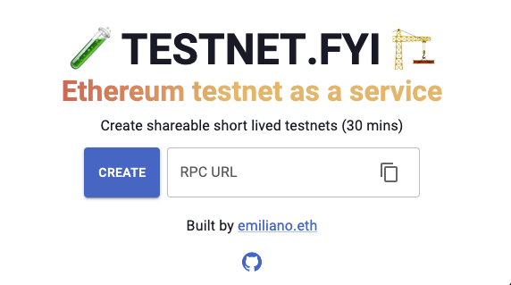

# 🧪 Testnet.fyi 🏗️

A simple [Testnet as a Service](https://testnet.fyi) - create shareable short lived testnets

    

Based on [Foundry Anvil](https://github.com/foundry-rs/foundry/tree/master/anvil) and [AWS](https://aws.amazon.com/)

## High level description

A simple serverless [API](./api) to spawn a testnet as a serverless container running an Anvil node

A simple [frontend](./frontend) to interact with the API

## Running costs

For 3 concurrent networks running daily, monthly bill is ~$30

[AWS cost estimate](https://calculator.aws/#/estimate?id=daf271b278629413f26db7a74aa560ba5af8959b)

## Contributing

Feel free to dive in and fork! [Open](https://github.com/emilianobonassi/testnet-fyi/issues/new) an issue, [start](https://github.com/emilianobonassi/testnet-fyi/discussions/new) a discussion or submit a PR
